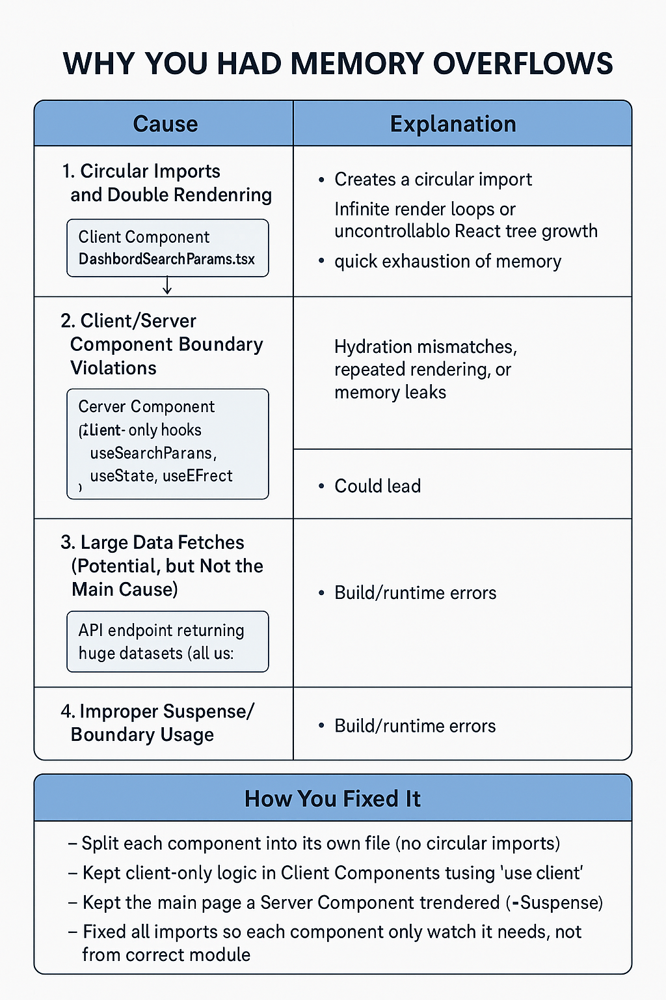

## 🛠️ Refactor: Split Client/Server Components, Fix Imports, Resolve Memory Issues

### 📌 Summary
This refactor addresses memory overflow (OOM) issues and build/runtime errors caused by circular imports, improper component boundaries, and incorrect usage of client-only hooks.

---

### ✅ What Was Done

- 🔄 **Split client and server components** into separate files:
  - Removed circular import between `DashboardSearchParamsHandler.tsx` and the page.
  - Ensured each component only imports what it needs.

- ⚠️ **Client-only logic moved to proper Client Components**:
  - Hooks like `useSearchParams`, `useState`, and `useEffect` now live only inside files marked with `'use client'`.

- 🧱 **Main page refactored to a Server Component**:
  - It now simply renders the Client Component inside a `<Suspense>` wrapper.
  
- 🚫 **Removed circular imports and unnecessary shared logic** between handler and main page.

---

### 💥 Root Causes of Previous Memory Overflows

| Cause                              | Explanation                                                                 |
|-----------------------------------|-----------------------------------------------------------------------------|
| ❌ Circular Imports               | Created infinite loops or React tree bloat → memory overload                |
| 🚫 Client Hooks in Server Comps   | Caused hydration mismatches, rendering loops, or memory leaks               |
| 📊 Large API Fetches (Potential)  | Risk of loading massive datasets into memory without pagination             |
| 🔁 No Suspense for Client Hooks   | Client hooks without `<Suspense>` lead to build/runtime hydration issues    |

---

### ✅ Fixes Summary Table

| Fix Applied                          | Purpose                                               |
|--------------------------------------|-------------------------------------------------------|
| Separated all components by purpose | Avoids circular imports, improves modularity          |
| Used `'use client'` correctly       | Ensures client-only logic stays on the client         |
| Wrapped client components in Suspense| Prevents hydration/build issues on server-rendered pages |
| Cleaned up imports                  | Prevents duplication and redundant tree inclusion     |

---

### 🧠 Notes for Future Me

- Always separate **Client** and **Server** responsibilities.
- If you're using `useSearchParams`, `useState`, etc., **it must be in a `'use client'` file**.
- Use `<Suspense>` when rendering client components from server files.
- Watch out for **circular imports** — even one can silently cause massive memory issues or infinite re-renders.

